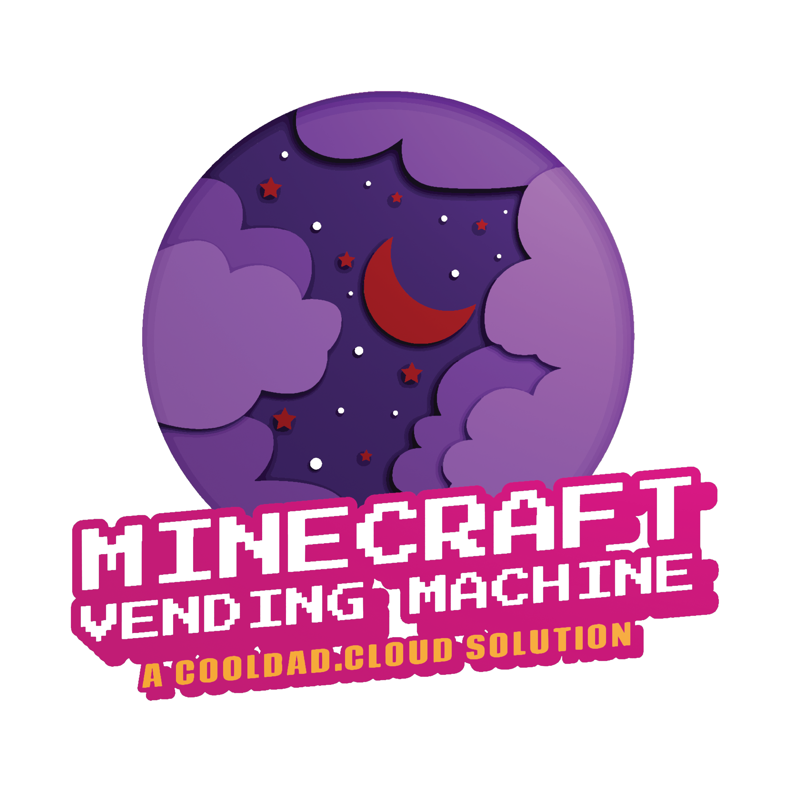
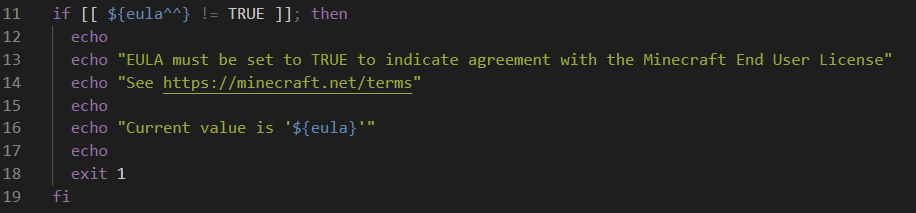
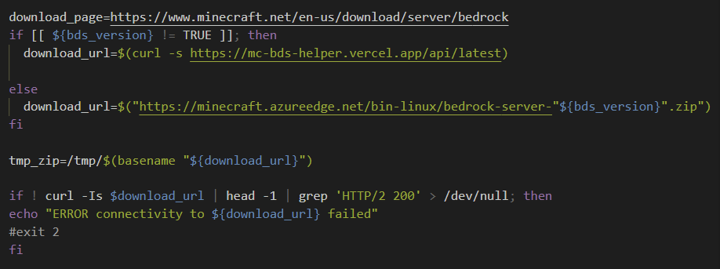
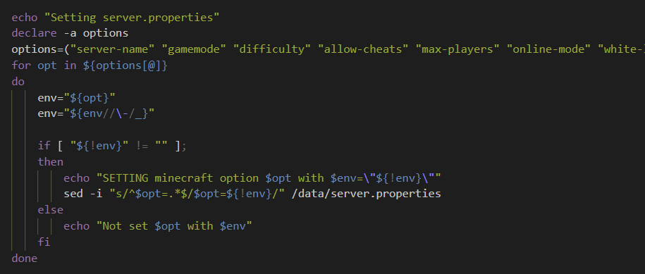

# Minecraft Vending Machine
<p align="center">
  </br>
  <a href="#intro">Intro</a> |
  <a href="#overview">Overview</a> |
  <a href="#setup">Setup</a> 
</p>

## Intro
  Hello. This project was initially developed out of a need to quickly deploy and re-deploy my own [Minecraft](https://minecraft.fandom.com/wiki/Minecraft_Wiki) servers, in the cloud, for free!* The servers are used in various scenarios; work projects, family gaming, kid coding camp sessions, and so dad can nerd out with his friends. :nerd_face:
  
  The project is also being used to demo, teach, learn, and play with the cool cloud tech listed in the [tech](#tech) section by everyday folks. 
  
  Welcome to the community! 
  * If you want a lot more project background and technical overview, continue to the next section.

  * If you want to jump into the deep end, I like your style, head over to the [setup](#setup) section. 

  * If you'd like to contribute to code, you are awesome, please check out the [contribute](#contribute) section.
  
  * Project custodian contact details located in the [meta](#meta) section.

    * Share feedback and comments via listed socials
    * Submit issues, bugs, feature requests via [GitHub](https://github.com/cool-tech-dad/minecraft-vending-machine/issues)
  
  * Get help at [CoolDad.Cloud Discord](https://discord.gg/d2RzNTYk)

  ### Only the first 30 days or $200 of cloud consumption are free. 💰
  Stop or delete cloud compute resources when not in use to save on runtime costs. A [Minecraft client](https://www.minecraft.net/en-us/get-minecraft#) is required to connect to the server and play, DO NOT purchase/use the Java client, more on this in the next section.  

## Overview
  [Minecraft server](https://minecraft.fandom.com/wiki/Server) is developed in two languages; C++ ([Bedrock](https://minecraft.fandom.com/wiki/Bedrock_Edition)) and [Java](https://minecraft.fandom.com/wiki/Server) and packaged as a single executable (.exe). Due to licensing, we cannot distribute the software, meaning we'll need to download and install the binaries each a new server is deployed. 

  We will be using the Bedrock edition for better cross-platform gameplay, and.....uhhhhhh....yeaaaaah, anything but Java. 
  <p align="center">
    
  </p>

  As of now, the fastest method of deploying an app and its underlying runtime (OS, binaries, dependencies, etc.) is via [containers](https://www.docker.com/resources/what-container). A Docker image has already been packaged up and is publicly available on Docker Hub; the OS is [Ubuntu server](https://hub.docker.com/_/ubuntu/). The project specifies this image during deployment, however, you can also create your own by following the steps in the [image build](#image-build) section.

  [insert docker logo]

  Once we have our image, we need to load and launch it on some compute, attach persistent storage and a public network interface (Public IP), so our Minecraft clients can connect from anywhere :milky_way: via the Internet. That's where public cloud platforms, like Azure, come in very handy. The ease of use, speed of deployment, and scale capabilities of these platforms unlock very interesting possibilities for anyone willing to learn and use them. 

  Another benefit of public cloud platforms is that they usually provide us with a few different methods to build and host our applications, each with its benefits over the others and ideal use cases. [Infrastructure as code (IaC)](https://youtu.be/WhWf48kcEXU) is included in the project that is used to deploy our choice of cloud infra for our container to run on: 
  * [Azure Container Instance (ACI) - CaaS](https://docs.microsoft.com/en-us/azure/container-instances/) : containers are launched, on-demand, in a managed serverless Azure environment.
      * ACI is primarily used to launch isolated containers without the orchestration and management capabilities of a platform like K8S. 
      * ACI is a true CaaS, and usually a cheaper alternative to K8S and its platform-managed variants (AKS, GKE, EKS).

  * [Azure Kubernetes Service (AKS) - platform-managed K8S](https://docs.microsoft.com/en-us/azure/aks/): container deployed on a production-ready, fully-managed K8S cluster.
    * AKS is primarily used to launch, orchestrate, and manage the lifecycle of containers. 

  Instructions on how to deploy cloud infra are provided in the [setup](#setup) section. In all scenarios:
  * Game data (server .exe, user, and world databases) is stored on SMB Azure Files shares. The required Azure storage account is deployed when using included IaC. 

  * The Minecraft server process runs as root, a task to change this is in the backlog.

  As of now, the project only supports Azure for compute and storage, we are looking to add support for other platforms in future versions.

  [Insert Azure logo]

## Tech
  * Minecraft BDS 1.18.2.03
  * Ubuntu server 20.04
  * Docker version? 
  * Kubernetes (k8s) version?
    * [Azure Container Instance](https://docs.microsoft.com/en-us/azure/container-instances/)
    * [Azure Kubernetes Service](https://docs.microsoft.com/en-us/azure/aks/)
  * List other tech used in solution

## Setup
  ### Environment
  1. [Clone](https://cloneurl) or [download](https://dlurl) and unzip this project repo to your machine. You'll need to already have or install [git](https://git-scm.com/downloads) to clone. 
  2. Launch your preferred console and navigate to the 'minecraft-vending-machine' directory 
  3. Install the [Azure CLI](https://docs.microsoft.com/en-us/cli/azure/install-azure-cli)
    * a cross-platform tool to manage Azure resources and connect to cloud services via the command line.
      * Windows\
        `Invoke-WebRequest -Uri https://azcliprod.blob.core.windows.net/msi/azure-cli-2.31.0.msi -OutFile .\AzureCLI.msi; Start-Process msiexec.exe -Wait -ArgumentList '/I AzureCLI.msi /quiet'; rm .\AzureCLI.msi`

      * *nix (script runs on any flavor)\
        `curl -L https://aka.ms/InstallAzureCli | bash` 

      * macOS\
        `brew update && brew install azure-cli`

  4. Install the [Bicep CLI](https://docs.microsoft.com/en-us/azure/azure-resource-manager/bicep/install#azure-cli)
      * a declarative domain-specific language (DSL) used to deploy and configure Azure resources via code. 
      * there are 3rd party IaC substitutions available; Terraform, Ansible, Pulumi, etc. Bicep was used to keep project dependencies and costs down. IMO, cloud-native interfaces usually provide better experiences and performance.

  5. [Open a free Azure account and PAYG subcription](https://azure.microsoft.com/en-us/free/)
      * If you are using a pre-existing Azure subscription, [verify](https://docs.microsoft.com/en-us/azure/role-based-access-control/check-access) that you have at least Owner role assigned at the subscription level.

  6. Set the context of your Azure CLI to the correct subscription\
      `az account set --subscription <replace with name>`

      `az account show`
  7. Create a [resource group](https://docs.microsoft.com/en-us/azure/azure-resource-manager/management/manage-resource-groups-portal#what-is-a-resource-group) in your preferred Azure region, all resource deployments will target this group\
    `az group create --name rg-cooldad-mvm --location <preferred Azure region e.g. eastus2>`
      * To list all available Azure regions\
        `az account list-locations`

  ### Deployment
  1. Pick your preferred cloud infra pattern and deploy it:
      ##### ACI (fast, small, cheap)

      ##### AKS (scalable, fully-managed, production-ready)
        * Additional permissions are required to manage the K8S cluster. [Assign]((https://docs.microsoft.com/en-us/azure/role-based-access-control/role-assignments-steps)) the following Azure RBAC roles to your username at the subscription level:  
          * [AKS Cluster Admin](https://docs.microsoft.com/en-us/azure/role-based-access-control/built-in-roles#azure-kubernetes-service-cluster-admin-role)
          * [AKS Contributor](https://docs.microsoft.com/en-us/azure/role-based-access-control/built-in-roles#azure-kubernetes-service-contributor-role)
          * [AKS Service RBAC Cluster Admin](https://docs.microsoft.com/en-us/azure/role-based-access-control/built-in-roles#azure-kubernetes-service-rbac-cluster-admin)
        * Deploy AKS infra resources
          `az deployment group create --name deploy-cooldad-mvm-aks --resource-group rg-cooldad-mvm --template-file .\deploy-aks\main.bicep --parameters .\deploy-aks\_main.params.json`
        * Retrieve important deployment output values, take note of these or save in CLI variables\
          `az deployment group show -g rg-cooldad-mvm -n deploy-cooldad-mvm-aks --query properties.outputs.acr_name.value`
            
          `az deployment group show -g rg-cooldad-mvm -n deploy-cooldad-mvm-aks --query properties.outputs.aks_name.value`
        * Check that AKS has access to pull images from ACR\
          `az aks check-acr --acr <acr name>.azurecr.io --name <aks name> --resource-group rg-cooldad-mvm`
        * Connect to ACR, pull custom image from Docker Hub. If you created your own image replace the image specified `cooltechdad/minecraft-bds:0.5` with your image's details.

          `az acr login --name <acr name> --expose-token`

          `az acr import --name <acr name> --source docker.io/cooltechdad/minecraft-bds:0.5 --image cooltechdad/minecraft-bds:0.5 --force`
        * Log into the AKS cluster\
          `az aks get-credentials --resource-group rg-cooldad-mvm --name <aks name>`
        * Configure Persistent Volume Claims (PVCs)\
          `kubectl apply -f .\azure_files_pvc.yaml`

  2. Customize Minecraft server deployment
      *  Open file ```.\service\minecraft-bds.yml``` with your preffered text editor.
          * This file declares the configuration, or spec, of the app we are trying to deploy on k8s. 
      * Specify your ACR's name and the image to use/pull on line 25
        * If you are using the CoolDad image, only plug in your ACR's name\
        `image: <ACR name>.azurecr.io/cooltechdad/minecraft-bds:0.5`
        * If you are creating your own image, plug in your ACR's name and image details\
        `image: <ACR name>.azurecr.io/<path/image name:image tag>`
      * Modify [server](https://minecraft.fandom.com/wiki/Server.properties) and gameplay settings for all users:
        ```
          - name: level_name #changing value results in player data loss
            value: "Bedrock level"            
          - name: gamemode
            value: "creative"
          - name: difficulty
            value: "normal"
          - name: allow_cheats
            value: "false"
          - name: max_players
            value: "1000"
        ```
      * Save your changes and close the file
  
  3. Deploy Minecraft server
      * Log into the AKS cluster\
        `az aks get-credentials --resource-group rg-cooldad-mvm --name <aks name>`
      * Launch the container and configure the service\
        `kubectl apply -f .\minecraft-bds.yaml`
      * Start the log stream to observe for errors\
      `kubectl logs -f statefulSets/mc-bds-001`
      * You should see similar output confirming server settings and port 19132 listening
      * Run the following command to list the public IP of the service, your clients will need this IP to connect
      * Congrats, you have successfully deployed a Minecraft Server container, on k8s, in the public cloud! 🎉
  
  4. Connect and Play! :video_game:
      * Load up your favorite [Minecraft client](https://www.minecraft.net/en-us/get-minecraft#) (no Java!)
      * Click on `Play`, add server via the `Servers` tab

      <p align="center">
        
      </p>

      * Additional steps are required for Xbox clients, will be added in the next version.
      * Select server and click on  `Join Server`
  
  5. Cleanup\
      Cloud can get expensive fast, prevent surprise costs by forcibly deleting all resources when your done `az group delete -n rg-cooldad-mvm -y` or stopping all computer resources when not in use.  

  ### Additional scenarios
  * AKS: Add additional node pool, deploy multiple Minecraft servers on a single AKS. Included in the next version.
  * ACI: Deployment guide and code will be included in the next version.

  ### T-shooting
  * Use [platform activity](https://docs.microsoft.com/en-us/azure/azure-monitor/essentials/activity-log#view-the-activity-log) logs to investigatge deployment errors.
      
  * Use [kubelet](https://docs.microsoft.com/en-us/azure/aks/kubelet-logs) logs from AKS nodes to investigatge cluster configuration errors.
      
  ### Lessons learned
  Below is a list of gotchas we ran into when running Minecraft server using a container-based approach, and how we solved for each: 
  * #### We are restricted from distributing/including the server software in our image, the server experience is customized (creative vs. survival mode) by modifying the desired [server properties](https://minecraft.fandom.com/wiki/Server.properties) on a local config file, and the EULA must be accepted when the server is started. 
    The above requires us to download and install the software, set server properties, then start the server with EULA accepted in a programmatic / fully-automated fashion (no manual or human intervention). A Bash script (run-bds.sh) was developed and packaged into our image to address the above project requirements.

    <p align="center">
      
    </p>
    <p align="center">
      
    </p>
    <p align="center">
      
    </p>
  
  * #### Minecraft server is a stateful application, game data (user and world saved states) is saved on local volumes. Data loss is inevitable due to the ephemeral nature of container storage.
    The above requires us to persist data outside of the running container. Persistent volumes (PVs) are created and presented to the running container, [Azure Files](https://docs.microsoft.com/en-us/azure/storage/files/storage-files-introduction) shares provide the underlying data store for our PVs.      

  ### Image Build
  Follow these steps if you'd like to build and publish your container image (not as hard as it sounds).
  1. Install Docker on your machine
      * [Windows](https://docs.docker.com/desktop/windows/install/)
      * [*nix](https://docs.docker.com/engine/install/)
      * [*macOS](https://docs.docker.com/desktop/mac/install/)
  2. Create a [Docker Hub subscription](https://hub.docker.com/)
      * required to host your image
  3. In your CLI navigate to `Docker`
  4. Build the docker image using the project DockerFile, provide an image name and tag/version number for this build\
    `docker build --pull --rm -f "DockerFile" -t <image name>:<tag> "."`
      
      * Real-world example\
        `docker build --pull --rm -f "DockerFile" -t cooltechdad/minecraft-bds:0.5 "."`
  5. Test image by running locally\
    `docker run --name test --rm -it -e debug=TRUE -e eula=TRUE <image name>:<tag>`
      * Stop test `docker stop test`
  6. Tag and Push/upload image to Docker Hub\
    `docker tag <image name>:<tag> <path>/<image name>:<tag>`\
    `docker push <path>/<image name>:<tag>`
    
      * Real-world example\
        `docker tag minecraft-bds:0.5 cooltechdad/minecraft-bds:0.5`\
        `docker push cooldad/minecraft-bds:0.5`
    

## Meta
  Maintained by: Sam M. (CoolDad)\
  [@tech_dad_](https://twitter.com/tech_dad_)\
  [GitHub](https://github.com/archsam)

## Contribute
1. Fork project (<https://github.com/cool-tech-dad/minecraft-vending-machine/fork>)
2. Create your feature branch `git checkout -b feature/foo_bar`
3. Commit your changes `git commit -am 'Add some foo_bar'`
4. Push to the branch `git push origin feature/foo_bar`
5. Create a new Pull Request

## Backlog
  * Change server runtime context to a non-root user
  * Add backup to the persistent data store (Azure Files)
  * AKS with multiple node pools and Minecraft servers
  * [Minecraft Education](https://education.minecraft.net/en-us/homepage) container image

## Change Log
0.5.0 Initial beta release

[Distributed under the GNU V3 license](https://gnu.org/licenses)