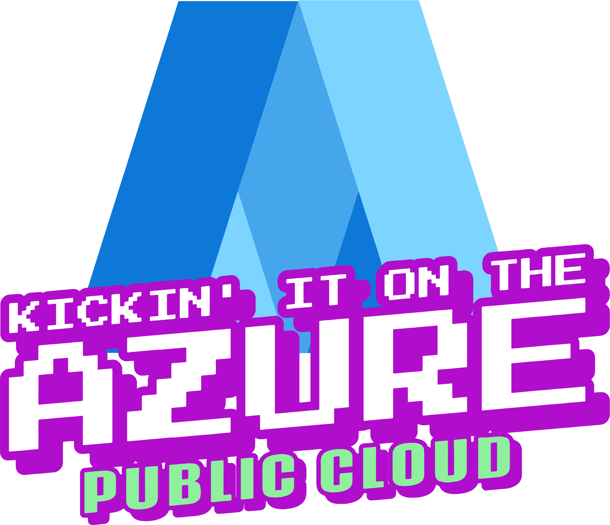
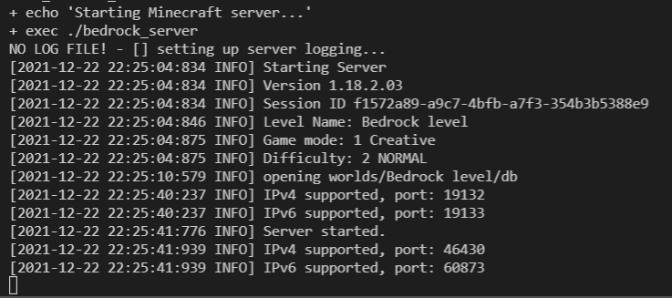
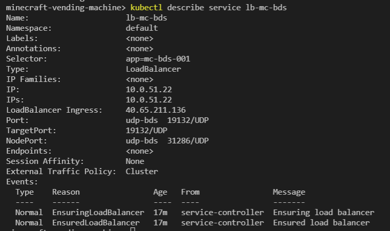
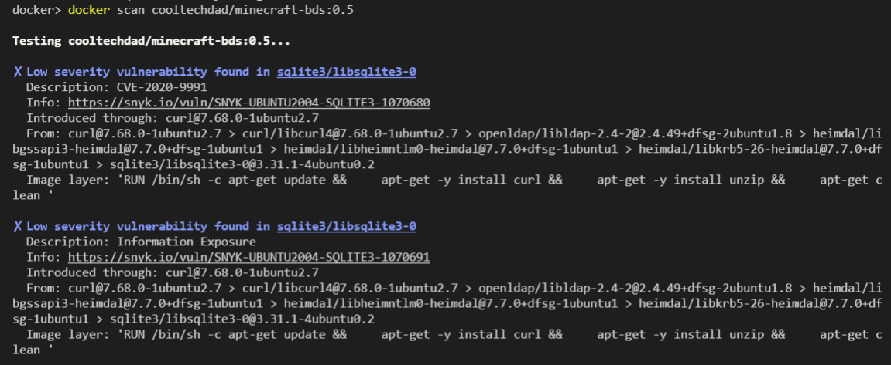
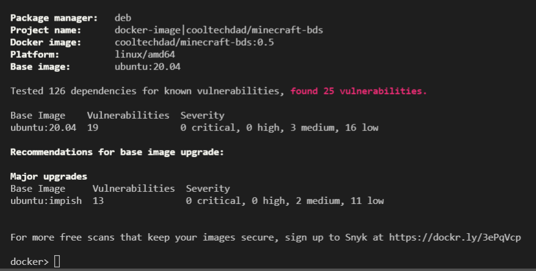
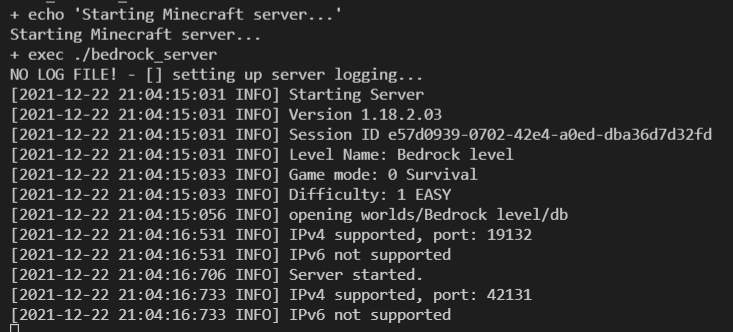

# Minecraft Vending Machine
<p align="center">
  </br>
  <a href="#intro">Intro</a> |
  <a href="#overview">Overview</a> |
  <a href="#setup">Setup</a> 
</p>

## Intro
  Hello. This project was initially developed out of a need to quickly deploy and re-deploy my own [Minecraft](https://minecraft.fandom.com/wiki/Minecraft_Wiki) servers, in the cloud, as cheap as possible*. The servers are then used in various scenarios; work projects, family gaming, kid coding camp sessions, and so dad can nerd out with his friends. :nerd_face:
  
  The project is also being used to demo, teach, learn, and play with the cool cloud tech listed in the [tech](#tech) section. 
  
  Welcome! 
  * If you want a lot more project background and technical overview, continue to the next section.

  * If you want to jump into the deep end, I like your style, head over to the [setup](#setup) section. 

  * If you'd like to contribute to code, you are awesome, please check out the [contribute](#contribute) section.
  
  * Project custodian contact details located in the [meta](#meta) section.

    * Share feedback and comments via listed socials
    * Submit issues, bugs, feature requests via [GitHub](https://github.com/cool-tech-dad/minecraft-vending-machine/issues)
  
  * Get help at the [CoolTechDad.Cloud Discord](https://discord.gg/aCnzN2QsQE) 

  ### * Only the first 30 days or $200 of cloud consumption are free. 💰
  Stop or delete cloud compute resources when not in use to save on runtime costs. A [Minecraft client](https://www.minecraft.net/en-us/get-minecraft#) is required to connect to the server and play, DO NOT purchase/use the Java client, more on this in the next section.  

## Overview
  [Minecraft server](https://minecraft.fandom.com/wiki/Server) is developed in two languages; C++ ([Bedrock](https://minecraft.fandom.com/wiki/Bedrock_Edition)) and [Java](https://minecraft.fandom.com/wiki/Server) and packaged as a single executable (.exe). Due to licensing, we cannot distribute the software, meaning we'll need to download and install the binaries each time a new server is deployed. 

  We will be using the Bedrock edition for better cross-platform gameplay, and...uhh...yeaaah, anything but Java. 
  <p align="center">
    
  </p>

  As of now, the fastest method of deploying an app and its underlying runtime (OS, binaries, dependencies, etc.) is via [containers](https://www.docker.com/resources/what-container). A Docker image has already been packaged up and is [publicly available](https://hub.docker.com/repository/docker/cooltechdad/minecraft-bds) on Docker Hub; the base OS is [Ubuntu server](https://hub.docker.com/_/ubuntu/). The project uses this image by default during deployment, however, you can also create and use your own image following the steps in the [image build](#image-build) section.

  <p align="center">
    </br>
  </p>

  Once we have our image, we need to load and launch it on some compute, attach persistent storage and a public network interface (Public IP), so our Minecraft clients can connect from anywhere :milky_way: via the Internet. That's where public cloud platforms, like Azure, come in very handy. The ease of use, speed of deployment, and scale capabilities of these platforms unlock very interesting possibilities for anyone willing to learn and use them. 

  Another benefit of public cloud platforms is that they usually provide us with a few different methods to build and host our applications, each with its benefits over the others and ideal use cases. [Infrastructure as code (IaC)](https://youtu.be/WhWf48kcEXU) is included in the project that is used to deploy our choice of cloud infra for our container to run on: 
  * [Azure Container Instance (ACI) - CaaS](https://docs.microsoft.com/en-us/azure/container-instances/) : containers are launched, on-demand, in a managed serverless Azure environment.
      * ACI is primarily used to launch isolated containers without the orchestration and management capabilities of a platform like K8S. 
      * ACI is a true CaaS, and usually a cheaper alternative to K8S and its platform-managed variants (AKS, GKE, EKS).

  * [Azure Kubernetes Service (AKS) - platform-managed K8S](https://docs.microsoft.com/en-us/azure/aks/): container deployed on a production-ready, fully-managed K8S cluster.
    * AKS is primarily used to launch, orchestrate, and manage the lifecycle of containers. 

  Instructions on how to deploy cloud infra are provided in the [setup](#setup) section. In all scenarios:
  * Game data (server .exe, user, and world databases) is stored on SMB Azure Files shares. The required Azure storage account is deployed when using included IaC. 

  * The Minecraft server process runs as root, a task to change this is in the backlog.

  As of now, the project only supports Azure for compute and storage, we are looking to add support for other platforms in future versions.

  <p align="center">
    </br>
  </p>

## Tech
  * Minecraft BDS 1.18.2.03
  * Ubuntu server 20.04
  * Docker 20.10 (if creating your own image)
  * Compute options:
    * Containers as a Service (CaaS)
      * [Azure Container Instance (ACI)](https://docs.microsoft.com/en-us/azure/container-instances/)
    * Kubernetes 1.20.9 (K8S)
      * [Azure Kubernetes Service (AKS)](https://docs.microsoft.com/en-us/azure/aks/)

## Setup
  ### Environment
  1. [Clone](https://github.com/cool-tech-dad/minecraft-vending-machine) or [download](https://github.com/cool-tech-dad/minecraft-vending-machine/archive/refs/heads/main.zip) this project repo to your machine. 
      * If you download, unzip the contents to a local directory. 
      * To clone, you'll need to already have or install [git](https://git-scm.com/downloads). 
  2. Launch your preferred console and navigate to the `.\minecraft-vending-machine` directory 
  3. Install the [Azure CLI](https://docs.microsoft.com/en-us/cli/azure/install-azure-cli)
    * a cross-platform tool to manage Azure resources and connect to cloud services via the command line.
      * Windows

        `Invoke-WebRequest -Uri https://azcliprod.blob.core.windows.net/msi/azure-cli-2.31.0.msi -OutFile .\AzureCLI.msi; Start-Process msiexec.exe -Wait -ArgumentList '/I AzureCLI.msi /quiet'; rm .\AzureCLI.msi`

      * *nix (script runs on any flavor)

        `curl -L https://aka.ms/InstallAzureCli | bash` 

      * macOS

        `brew update && brew install azure-cli`

  4. Install preferred cloud infrastructure / resource deployment framework:
      * [Azure Bicep CLI](https://docs.microsoft.com/en-us/azure/azure-resource-manager/bicep/install#azure-cli)
        * Platform-native, declarative domain-specific language (DSL) used to deploy and configure Azure resources via code. 
        * there are 3rd party IaC substitutions available; Terraform, Ansible, Pulumi, etc. Bicep was used to keep project dependencies and costs down. IMO, cloud-native interfaces usually provide better experiences and performance.
      <!---* [Terraform CLI](https://learn.hashicorp.com/tutorials/terraform/install-cli?in=terraform/azure-get-started)
        * 3rd party IaC provider--->

  5. [Open a free Azure account and PAYG subcription](https://azure.microsoft.com/en-us/free/)
      * If you are using a pre-existing Azure subscription, [verify](https://docs.microsoft.com/en-us/azure/role-based-access-control/check-access) that you have at least Owner role assigned at the subscription level.

  6. Set the context of your Azure CLI to the correct subscription

      `az account set --subscription <replace with name>`

      `az account show`
  7. Create a [resource group](https://docs.microsoft.com/en-us/azure/azure-resource-manager/management/manage-resource-groups-portal#what-is-a-resource-group) in your preferred Azure region, all resource deployments will target this group

      `az group create --name rg-cooldad-mvm --location <preferred Azure region e.g. eastus2>`

      * To list all available Azure regions\
          `az account list-locations`

  ### Deployment
  1. Pick your preferred cloud infra pattern and deploy it:
      #### ACI (fast, small, cheap)
      * Sorry, currently developing the infra code to deploy this scenario, check back soon! Check out the AKS pattern below, the deployment has been cost optimized,  shouldnt ding your credits too bad to use for a few sessions of game play. 

      #### AKS (scalable, fully-managed, production-ready)
        * Additional permissions are required to manage the K8S cluster. [Assign]((https://docs.microsoft.com/en-us/azure/role-based-access-control/role-assignments-steps)) the following Azure RBAC roles to your username at the subscription level:  
          * [AKS Cluster Admin](https://docs.microsoft.com/en-us/azure/role-based-access-control/built-in-roles#azure-kubernetes-service-cluster-admin-role)
          * [AKS Contributor](https://docs.microsoft.com/en-us/azure/role-based-access-control/built-in-roles#azure-kubernetes-service-contributor-role)
          * [AKS Service RBAC Cluster Admin](https://docs.microsoft.com/en-us/azure/role-based-access-control/built-in-roles#azure-kubernetes-service-rbac-cluster-admin)
        * Deploy AKS infra resources using Azure Bicep (IaC):
          
          `az deployment group create --name deploy-cooldad-mvm-aks --resource-group rg-cooldad-mvm --template-file .\deploy-aks\main.bicep --parameters .\deploy-aks\_main.params.json`

        * Retrieve important deployment output values, take note of these or save in CLI variables

          `az deployment group show -g rg-cooldad-mvm -n deploy-cooldad-mvm-aks --query properties.outputs.acr_name.value`
            
          `az deployment group show -g rg-cooldad-mvm -n deploy-cooldad-mvm-aks --query properties.outputs.aks_name.value`
        * Log into the AKS cluster

          `az aks get-credentials --resource-group rg-cooldad-mvm --name <aks_name>`
        * Configure Persistent Volume Claims (PVCs)

          `kubectl apply -f .\deploy-aks\azure_files_pvc.yaml`

  2. Customize Minecraft server deployment
      *  Open file `.\deploy-aks\minecraft-bds.yml` with your preffered text editor. This file declares the configuration, or spec, of the app we are trying to deploy on K8S. 
      * Modify [server](https://minecraft.fandom.com/wiki/Server.properties) and gameplay settings for all users:
        ```
          - name: level_name #changing value results in player data loss
            value: "Bedrock level"            
          - name: gamemode
            value: "creative"
          - name: difficulty
            value: "normal"
          - name: allow_cheats
            value: "false"
          - name: max_players
            value: "1000"
        ```
      * Save your changes and close the file

  3. Deploy Minecraft server
      * Log into the AKS cluster

        `az aks get-credentials --resource-group rg-cooldad-mvm --name <aks_name>`
      * Launch the container and configure the service

        `kubectl apply -f .\deploy-aks\minecraft-bds.yaml`
      * Start the log stream to observe for errors

        `kubectl logs -f statefulSets/ss-mc-bds-001`
      
      * If all is good, you should see the following output in your CLI. Were looking at the `Info` logs Minecraft outputs to verify server settings and that the server is listening: `IPv4 supported, port: 19132`.

        <p align="center">
          
        </p>

      * View the details of your service's public ingress interface (Load balancer). Look for `LoadBalancer Ingress`; the Public IP listed is the IP that that you will provide to your clients.

        `kubectl describe service lb-mc-bds`

        <p align="center">
          
        </p>

      * 🎉 Congrats, you have successfully deployed a Minecraft Server container, on K8S, in the public cloud, time to connect! 

      <p align="center">
        
      </p>
  

  4. :video_game: Connect and Play! 
      * Load up your favorite [Minecraft client](https://www.minecraft.net/en-us/get-minecraft#) (no Java!) and add your server.

      <p align="center">
        
      </p>

      * Additional steps are required for Xbox clients, will be added in the next version.

  5. Cleanup\
      Cloud can get expensive fast, prevent surprise costs by forcibly deleting all resources when your done `az group delete -n rg-cooldad-mvm -y` or stopping all computer resources when not in use.  

      <p align="center">
        
      </p>

  ### Additional deployment scenarios
  Details for the following scenarions will be added in the next version:
  * Creating, hosting and deploying a custom Docker image
  * Hosting multiple Minecraft servers / instances on AKS 
<!---##### Custom Docker Image
    ### Image Build
  Follow these steps if you'd like to build and publish your container image (not as hard as it sounds).
  1. Install Docker on your machine
      * [Windows](https://docs.docker.com/desktop/windows/install/)
      * [*nix](https://docs.docker.com/engine/install/)
      * [*macOS](https://docs.docker.com/desktop/mac/install/)
  2. Create a [Docker Hub subscription](https://hub.docker.com/)
      * Required to host your image.
      * Make sure to verify your email, otherwise you will not be able to upload your image. 
  3. In your CLI navigate to the `.\docker` directory
  4. Build the docker image using `.\docker\DockerFile`. Assign an image name and tag, its recommended you use a build version number for tag. 

      `docker login`

      `docker build --pull --rm -f "DockerFile" -t <image name>:<tag> "."`
      
      * Real-world example\
        `docker build --pull --rm -f "DockerFile" -t minecraft-bds:0.5 "."`
  5. Found this cool new integration when building the latest version, container vulnerabliity scanning integrated right into the build pipeline, made possible by [Synk!](https://docs.snyk.io/products/snyk-container/image-scanning-library/docker-hub-image-scanning)

      <p align="center">
        
      </p>
      <p align="center">
        
      </p>
      <p align="center">
        
      </p>

      * To run an assessment on your image and output the results to a local file, specify your image details\
        `docker scan <image name>:<tag> > .\_vul_scan_out.txt`

      * Real-world example\
        `docker scan minecraft-bds:0.5 > .\_vul_scan_out.txt`

      * At this point you can address any vulnerabilites found and re-package the image, or accept risk and move on. 

  5. Test image locally. 
      * Specify required contianer environemnt variables.  
      * To download the latest version of Minecraft server, specify 'latest', otherwise specify the full version number, eg. `1.18.2.03`. 

        `docker run --name test --rm -it -e debug=TRUE -e eula=TRUE -e bds_version=1.18.2.03 <image name>:<tag>`

      * Real-world example\
          `docker run --name test --rm -it -e debug=TRUE -e eula=TRUE -e bds_version=1.18.2.03 minecraft-bds:0.5`
      
      * If all is good, you should see the following output in your CLI. Were looking at the `Info` logs Minecraft outputs.

        <p align="center">
          
        </p>

      * Stop test\
        `^C`\
        `docker stop test`
  6. Tag and push/upload image to Docker Hub

      `docker tag <image name>:<tag> <namespace>/<image name>:<tag>`

      `docker push <namespace>/<image name>:<tag>`
    
      * Real-world example\
        `docker tag minecraft-bds:0.5 cooltechdad/minecraft-bds:0.5`

        `docker push cooltechdad/minecraft-bds:0.5`
      
      * After you image is pushed, its public URI will be, please take note of this, you'll need it during deployment: `docker.io/<namespace>/<image name>:<tag>`

      * The latest version of CoolTechDad's image for this project
        * Source `docker.io/cooltechdad/minecraft-bds:0.5`
        * URL https://hub.docker.com/repository/docker/cooltechdad/minecraft-bds
  * Specify your ACR's name and the image to use/pull on line 25
  * If you are using the CoolTechDad image, only plug in your ACR's name\
  `image: <acr_name>.azurecr.io/cooltechdad/minecraft-bds:0.5`
  * If you are creating your own image, plug in your ACR's name and image details\
  `image: <acr_name>.azurecr.io/<namespace/image name:image tag>`
  ##### Deploy AKS infra resources using Terraform (IaC):

    `az deployment group create --name deploy-cooldad-mvm-aks --resource-group rg-cooldad-mvm --template-file .\deploy-aks\main.bicep --parameters .\deploy-aks\_main.params.json`
#### ACI 
  * Deployment guide and code will be included in the next version.
  #### AKS
  * Check that AKS has access to pull images from ACR
      `az aks check-acr --acr <acr_name>.azurecr.io --name <aks_name> --resource-group rg-cooldad-mvm`
  * Connect to ACR, pull custom image from Docker Hub. If you created your own image replace the image specified `cooltechdad/minecraft-bds:0.5` with your image's details. If you want to build your own image, pause here head over to the [image build](#image-build) section, and resume here when you have pushed your own image to Docker Hub.
    
    `az acr login --name <acr_name> --expose-token`  
    
    `az acr import --name <acr_name> --source docker.io/cooltechdad/minecraft-bds:0.5 --image cooltechdad/minecraft-bds:0.5 --force`
  
  * Add additional node pool, deploy multiple Minecraft servers on a single cluster. Included in the next version.--->

  ### Deployment t-shooting
  * Use [platform activity](https://docs.microsoft.com/en-us/azure/azure-monitor/essentials/activity-log#view-the-activity-log) logs to investigatge deployment errors.
      
  * Use [kubelet](https://docs.microsoft.com/en-us/azure/aks/kubelet-logs) logs from AKS nodes to investigatge cluster configuration errors.
      
  ### Deployment lessons learned
  Below is a list of gotchas we ran into when running Minecraft server using a container-based approach, and how we solved for each: 
  * #### We are restricted from distributing/including the server software in our Docker image. Minecraft server [properties](https://minecraft.fandom.com/wiki/Server.properties) (eg. creative vs. survival mode) are set on a local config file. The EULA must be accepted before the server is started.
    The above requires us to download and install the server software, modify server properties, accept the EULA, then start the server in a programmatic / fully-automated fashion (no manual human intervention). The following was implemented to meet these requirements:
    
    * `.\docker\run-bds.sh` was developed to execute required tasks via CLI

      * Accept EULA 
        <p align="center">
          
        </p>
          
      * Download Minecraft server software and install
        <p align="center">
          
        </p>
      * Modify server properties
        <p align="center">
          
        </p>
      * Start server
        <p align="center">
          
        </p>
    * `.\docker\DockerFile` was developed to copy script into container image and set as a startup script during image build 
      
      ` COPY run-bds.sh /opt/`\
      ...\
      `ENTRYPOINT [ "/bin/bash", "/opt/run-bds.sh" ]`

  
  * #### Minecraft server is a stateful app, game data (user and world saved states) is saved on mounted volumes. Data loss is inevitable if stored locally due to the ephemeral nature of container storage.
    The above requires us to provide stable, persistent data storage to our containerized app via  Persistent Volumes (PVs). [Azure Files](https://docs.microsoft.com/en-us/azure/storage/files/storage-files-introduction) is used to provide persistent and stable data storage in all deployment models. 
      * This storage is managed manually if using ACI. 
      * AKS minimizes management overhead, by dynamically manage this storage for us.
    
<!---
    The following configurations are defined in the AKS deployment to meet these requirements:
      * A Persistent Volume Claim (PVC) that dynamically provisions Persistent Volumes (PVs) on the [Azure Files](https://docs.microsoft.com/en-us/azure/storage/files/storage-files-introduction) service is defined in `.\azure_files_pvc.yaml`. 
          ```
          kind: PersistentVolumeClaim
            metadata:
              name: pvc-001
            spec:
              storageClassName: sc-azure-files
          ```
        Create this PVC on K8S by applying the spec:
          
          `kubectl apply -f .\azure_files_pvc.yaml`

      * The above PVC is referenced in the app spec, `.\minecraft-bds-yaml`, used to launch our image: 

          ```
            volumes:
            - name: pv-001
                persistentVolumeClaim:
                  claimName:  pvc-001
          ``` 
          ```
          volumeMounts:
            - name: pv-001
              mountPath: /data
          ```     
      * A [StatesfulSet](https://kubernetes.io/docs/concepts/workloads/controllers/statefulset/) desired state is defined for our app, instead of the typically used [Deployment](https://kubernetes.io/docs/concepts/workloads/controllers/deployment/) app kind.
        ```
        apiVersion: apps/v1
        kind: StatefulSet
        ```
      
        A StatefulSet configuration ensures that the same dynamically created PV is mapped to the K8S [pod](https://kubernetes.io/docs/concepts/workloads/pods/) running our app after system failures, reboots, or maintenance.
      
      * Deploy the stateful desired state by using the provided app spec:
      
        `kubectl apply -f .\minecraft-bds.yaml`
        
        K8S will first attempt to dynamically create a volume. If this fails, container creation fails. If it is successful, the PV will be mounted, and container creation will resume.
        --->
    

## Contribute
1. Fork project\
  <https://github.com/cool-tech-dad/minecraft-vending-machine/fork>
2. Create your feature branch\
  `git checkout -b feature/foo_bar`
3. Commit your changes\
  `git commit -am 'Add some foo_bar'`
4. Push to the branch\
  `git push origin feature/foo_bar`
5. Create a new Pull Request

## Contributors
- CoolTechDad\
    Twitter: [@cool_tech_dad_](https://twitter.com/cool_tech_dad_)\
    GitHub: [cool-tech-dad](https://github.com/cool-tech-dad)\
    Discord: CoolTechDad#7007


## Backlog
- [ ] Change server runtime context to a non-root user
- [ ] Add readiness probe to service spec 
- [ ] Add backup to the persistent data store (Azure Files)
- [ ] AKS with multiple node pools and Minecraft servers
- [ ] [Minecraft Education](https://education.minecraft.net/en-us/homepage) container image

## Change Log
0.5.0 Initial beta

[Distributed under the GNU V3 license](https://gnu.org/licenses)

## Sources
* Script : https://github.com/itzg/docker-minecraft-bedrock-server/blob/master/bedrock-entry.sh


