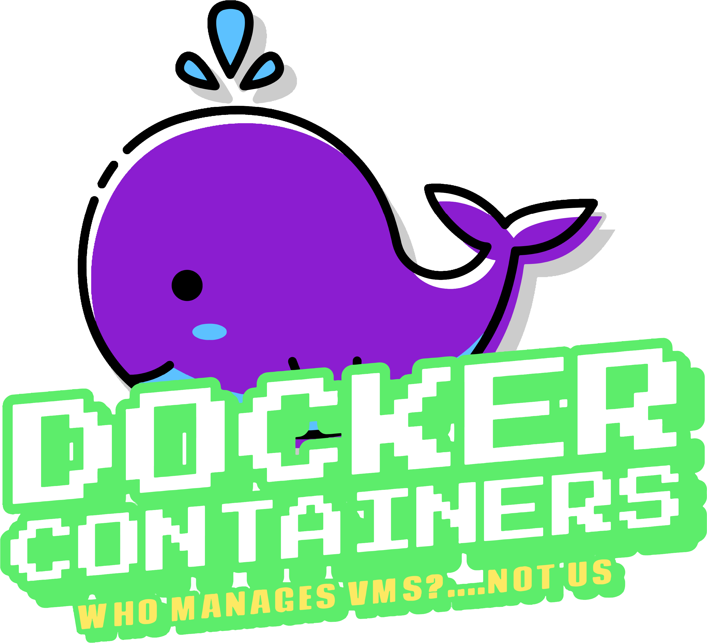

# Minecraft Vending Machine

   
  <a href="#intro">Intro</a> |
  <a href="#tech">Tech</a> |
  <a href="#overview">Overview</a> |
  <a href="./deploy/deploy.md">Deploy</a> |
  <a href="./deploy/deploy.md#connect">Connect</a>

## Intro
  Hello. I developed this project out of a need to quickly deploy and re-deploy our own [Minecraft](https://minecraft.fandom.com/wiki/Minecraft_Wiki) servers, as quickly and as cheap as possible*. The servers are used in various scenarios; work projects, family gaming, kid coding camps, and so dad can nerd out with his friends. :nerd_face:
  
  The project is also being used to demo, teach, learn, and play with the cool cloud tech listed in the [tech](#tech) section. 
  
  Welcome! 
  * If you want a lot more project background and technical details, continue to the next section.

  * If you'd like to contribute to code, you are fantastic, please check out the [contribute](#contribute) section.

  * To skip to the fun part, head over to the <a href="./deploy/deploy.md">deploy</a> doc.
  
  * Get help at the [CoolTech.Cloud Discord](https://discord.gg/JQ3Eg2nS) 

  #### Only the first 30 days or $200 of cloud consumption are free. 💰 Stop or delete cloud compute resources when not used to save on runtime costs. 
  A [Minecraft client](https://www.minecraft.net/en-us/get-minecraft#) is required to connect to the server and play, DO NOT purchase/use the Java clients.

## Tech
* Baseline:
  * [Minecraft Bedrock Dedicated Server (BDS)](https://minecraft.fandom.com/wiki/Bedrock_Dedicated_Server) 1.18.2.03
  * [Ubuntu server](https://hub.docker.com/_/ubuntu) 20.04
* Isolated and streamlined containers:
  * [Azure Container Instance (ACI)](https://docs.microsoft.com/en-us/azure/container-instances/)
* Fully-managed and orchestrated containers:
  * [Azure Kubernetes Service (AKS)](https://docs.microsoft.com/en-us/azure/aks/) 
  * [Kubernetes (K8S)](https://kubernetes.io/docs/concepts/overview/what-is-kubernetes/) 1.20.9
* Cloud managment tools: 
  * [Azure CLI](https://docs.microsoft.com/en-us/cli/azure/what-is-azure-cli) 2.31.0
* Infrastucture as Code (IaC) tools:
  * [Azure Bicep](https://docs.microsoft.com/en-us/azure/azure-resource-manager/bicep/overview?tabs=bicep)
  * [HashiCorp Terraform](https://www.terraform.io/intro)

## Overview
[Minecraft](https://en.wikipedia.org/wiki/Minecraft) is a procedurally generated, sandbox-style video game developed in [C++](https://minecraft.fandom.com/wiki/Bedrock_Edition) and [Java](https://minecraft.fandom.com/wiki/Server). The server and client software are standalone applications, and due to licensing, we cannot redistribute server software. We'll need to download and install the binaries during each server build.

To enable better cross-platform gameplay, we use the C++ Bedrock Dedicated Server (BDS) edition in this project. Also...yeah, anything but Java. 
  

    
  

Because I need to deploy and re-deploy servers quickly, the overall speed of deployment is critical. App portability is also a must-have since we have a variety of use cases for a Minecraft server. One of the most portable and fastest methods of hosting server applications and their underlying runtime (OS, libraries, platforms, etc.) is via app [containorization](https://www.docker.com/resources/what-container). We use [Ubuntu server](https://hub.docker.com/_/ubuntu/) as the base Operating System.

By default, all deployments use the latest version of the project's own container [image](https://hub.docker.com/r/cooltechdad/minecraft-bds/tags). If you'd like to build your own image (BYOI), pause here, follow the instructions on the <a href="./image.md">image build</a> doc.
  
  

     
  

Ok, we have the server app, dependencies, and required OS components packaged in a Docker Image. Now what? We need to launch the image on computers to create the runtime container.  Our container also needs some persistent storage and a public network interface (Public IP) our Minecraft clients can connect to from anywhere :milky_way: on the Internet. 
  
Cloud platforms, like Azure, come in very handy, they provide us techies with access hyper scale, publically avaialble compute and storage sevices to host our workloads. These cloud services provide us with a few different methods for hosting apps, each with its advantages over the others and ideal use cases. This project offers infrastructere pattern options to host a game server, each ideal for specific use cases, details provided in the <a href="./deploy/deploy.md">deploy</a> doc.

[Infrastructure as code (IaC)](https://youtu.be/WhWf48kcEXU) is used to automate the deployment and management of cloud resources. IaC allows devs to develop, deploy, and maintain application infrastructure just like software. 
  
Head over to the <a href="./deploy/deploy.md">deploy</a> doc to get started. 

## Lessons learned
  <a href="./lessons.md">This doc</a> lists the gotchas and pitfalls we ran into when running Minecraft BDS in a container, and how we solved for each.
  
## Contribute
Please follow the instructions below if you'd like to contribute to the project:
1. Fork project\
  <https://github.com/cool-tech-dad/minecraft-vending-machine/fork>
2. Create your feature branch\
  `git checkout -b feature/foo_bar`
3. Commit your changes\
  `git commit -am 'Add some foo_bar'`
4. Push to the branch\
  `git push origin feature/foo_bar`
5. Create a new Pull Request

## Contributors
* CoolTechDad\
  Twitter: [@x0coolTechDad](https://twitter.com/x0cooltechdad)\
  GitHub: [@x0coolTechDad](https://github.com/x0coolTechDad)\
  Discord: x0coolTechDad#7007

* Ted Martin\
  GitHub: [TedMartin](https://github.com/tedmartn)\
  Discord: tedwreckz#0892

## Backlog
- [X] Change server runtime context to a non-root user
- [ ] Unzip server sowftware locally first, then move to PV, possible [bug](https://bugzilla.redhat.com/show_bug.cgi?id=1418606)
- [ ] Add readiness probe to service spec 
- [ ] Add backup to the persistent data store (Azure Files)
- [ ] AKS with multiple node pools and Minecraft servers
- [ ] [Minecraft Education](https://education.minecraft.net/en-us/homepage) container image

## Change Log
* 0.5.0 Initial beta
* 0.6.0 Non-root container, custom Docker image, add Terraform support

[Distributed under the GNU V3 license](https://gnu.org/licenses)

## Sources
* Script: https://github.com/itzg/docker-minecraft-bedrock-server/blob/master/bedrock-entry.sh

