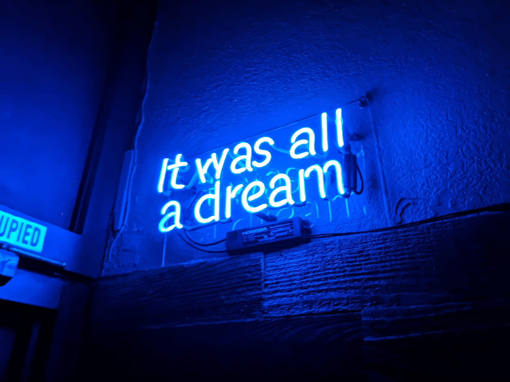

# Deploy Minecraft BDS Server (Container)

   
  <a href="../README.md">Home</a> |
  <a href="#environment-setup">Environment setup</a> |
  <a href="#server-deploy">Server deploy</a> |
  <a href="#connect">Connect</a> |
  <a href="#cleanup">Cleanup</a>

## Environment setup
1. [Clone](https://github.com/cool-tech-dad/minecraft-vending-machine) or [download](https://github.com/cool-tech-dad/minecraft-vending-machine/archive/refs/heads/main.zip) and unzip the project repo
2. Launch your preferred console, navigate to: `.\minecraft-vending-machine` 
3. Install the [Azure CLI](https://docs.microsoft.com/en-us/cli/azure/install-azure-cli), required to manage Azure resources:
    * Windows:\
      `Invoke-WebRequest -Uri https://azcliprod.blob.core.windows.net/msi/azure-cli-2.31.0.msi -OutFile .\AzureCLI.msi; Start-Process msiexec.exe -Wait -ArgumentList '/I AzureCLI.msi /quiet'; rm .\AzureCLI.msi`
    * *nix: `curl -L https://aka.ms/InstallAzureCli | bash` 
    * macOS: `brew update && brew install azure-cli`
4. Install a cloud infrastructure as code (IaC) tool:
    * [Azure Bicep CLI](https://docs.microsoft.com/en-us/azure/azure-resource-manager/bicep/install#azure-cli): Platform-native, declarative, domain-specific 
    * [Terraform CLI](https://learn.hashicorp.com/tutorials/terraform/install-cli?in=terraform/azure-get-started): Most popular 3rd party IaC tool
    * IMO, cloud-native interfaces usually provide better experience performance and keep project dependencies and costs down.
5. Open a free Azure account, [create a PAYG subcription](https://azure.microsoft.com/en-us/free/):
    * [Verify](https://docs.microsoft.com/en-us/azure/role-based-access-control/check-access) that you have at least Owner role permissions on existing subscriptions.
6. Log into Azure set the context to the correct subscription:

    `az login`\
    `az account set --subscription `
    * To list all available subscriptions: `az account list`

## Server deploy
All deployments use the latest version of CoolTechDad's Minecraft BDS container [image](https://hub.docker.com/r/cooltechdad/minecraft-bds/tags). If you'd like to build your own image, pause here, follow the instructions on the <a href="../image.md">image build</a> doc, and come back when you have your image's public URI.

Pick a cloud infrastructure pattern that will host the Minecraft server, deploy it:

  * ##### <a href="./caas/aci.md">Azure Container Instance (ACI)</a> (fast, small, cheap)
    * ACI is primarily used to launch isolated containers without orchestration and management capability overheaed. 
    * ACI is a true CaaS and usually a cheaper alternative to K8S and its platform-managed variants (AKS, GKE, EKS).
  * ##### <a href="./k8s/aks.md">Azure Kubernetes Service (AKS)</a>  (scalable, fully-managed, production-ready)
    * AKS is primarily used to launch, orchestrate, and manage the entire lifecycle of containers. 
  
  

     
  

## Connect
After a successful deployment, load up your favorite non-Java [Minecraft client](https://www.minecraft.net/en-us/get-minecraft#), add your server. Time to play !:video_game:
  
  * Windows 10: 
    

      
    

  * Android: Coming soon!
  * iOS: Comming soon!
  * Xbox: Coming soon!

## Cleanup
Cloud can get expensive fast, prevent surprise costs by forcibly deleting all resources when your done: 

`az group list --query "[? starts_with(name, 'rg-cooldad-mvm')][].{name:name}" -o tsv | % {az group delete --resource-group $_ -y}`

  

