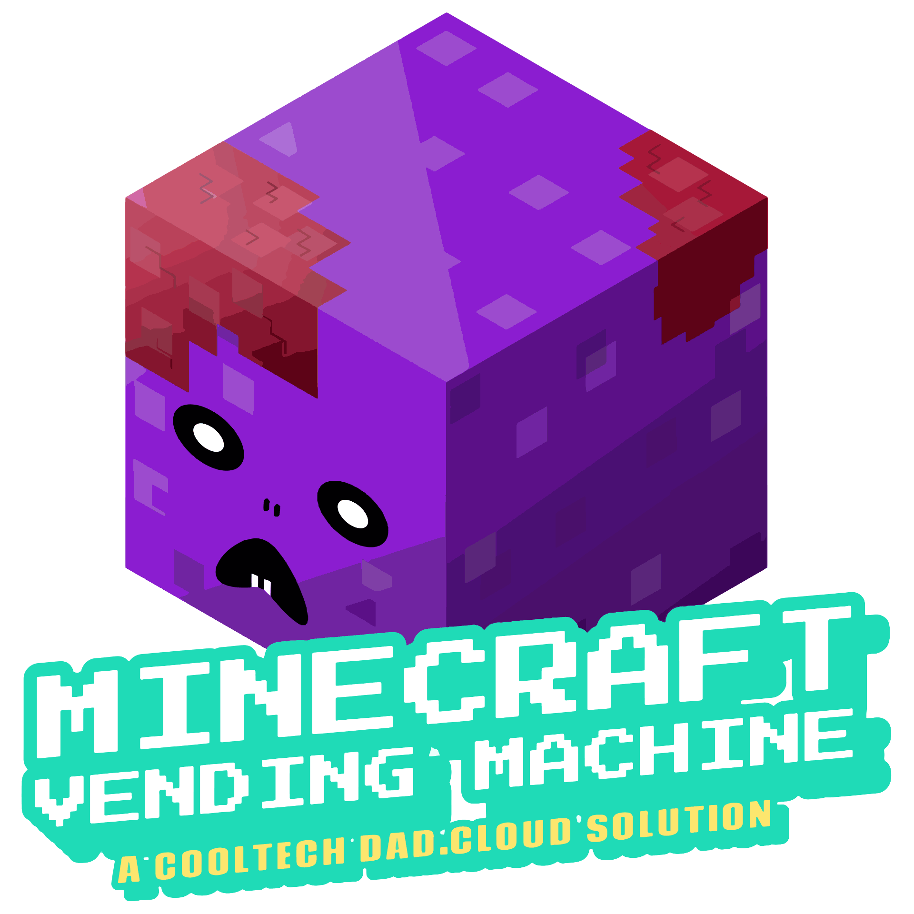

# Minecraft container on ACI (CaaS)
<p align="center">
  </br>
  <a href="../../README.md">Home</a> |
  <a href="#prereqs">Prereqs</a> |
  <a href="#bicep">Bicep</a> |
  <a href="#terraform">Terraform</a> |
  <a href="#service">Service</a>
</p>

# Prereqs
1. Additional permissions are required to manage the K8S cluster once deployed, [assign]((https://docs.microsoft.com/en-us/azure/role-based-access-control/role-assignments-steps)) the following Azure RBAC roles to your username at the subscription level:  
    * [AKS Cluster Admin](https://docs.microsoft.com/en-us/azure/role-based-access-control/built-in-roles#azure-kubernetes-service-cluster-admin-role)
    * [AKS Contributor](https://docs.microsoft.com/en-us/azure/role-based-access-control/built-in-roles#azure-kubernetes-service-contributor-role)
    * [AKS Service RBAC Cluster Admin](https://docs.microsoft.com/en-us/azure/role-based-access-control/built-in-roles#azure-kubernetes-service-rbac-cluster-admin)
2. In your console, navigate to: `.\deploy\k8s\`
3. Open file: `.\minecraft_bds.yml`
4. Modify Minecraft [server](https://minecraft.fandom.com/wiki/Server.properties) environmental settings if required, save and close file:
    * Minecraft server version, specify "latest" or full version number: `value: "1.18.2.03"`

      ```
      env:
        - name: debug
          value: "TRUE"
        - name: bds_version
          value: "1.18.2.03"
        - name: eula
          value: "TRUE"
        - name: level_name #changing value results in player data loss
          value: "Bedrock level"            
        - name: gamemode
          value: "creative"
        - name: difficulty
          value: "normal"
        - name: allow_cheats
          value: "false"
        - name: max_players
          value: "1000"
        - name: server_authoritative_movement
          value: "server-auth-with-rewind"
      ```
    * Save your changes and close the file
  
5. If your using a custom container image, replace the URI in file `.\minecraft_bds.yaml `, on line 25, save and close file.
6. Verify Azure CLI context before every deployment: `az account show`

# Deploy
Follow the deployment steps for your preffered IaC tool: 
## Bicep
  1. In your console, navigate to: `.\bicep\`
  2. Validate deployment, supply preferred region (eg. eastus):

      `az deployment sub create --name deploy-cooldad-mvm-aks --template-file .\main.bicep --location <location> --what-if`
  3. Apply deployment
          
      `az deployment sub create --name deploy-cooldad-mvm-aks --template-file .\main.bicep --location <location>`
      
  4. Retrieve deployment outputs, take note of cluster's name, or save in CLI variable for future use: 
    
      `az deployment sub show -n deploy-cooldad-mvm-aks --query properties.outputs.std_out.value`

Move onto the <a href="#service">service</a> section to complete app service deployment. 


## Terraform
  1. In your console, navigate to: `.\terraform\`
  2. Initialize Terraform and required backend (local state): 
  
      `terraform init`
  3. Validate deployment:

      `terraform validate`
  4. Apply deployment, supply preferred region (eg. eastus), accept changes:

      `terraform apply`
  5. Take note of the cluster name in the deployment output or save in CLI variable for future use. 


Move onto the next section to complete app service deployment. 

## Service
  1. Log into K8S, use cluster name retrieved from deployment output:

      `az aks get-credentials --resource-group rg-cooldad-mvm-aks --name <aks_name>`

  2. Configure Persistent Volume (PV):

      `kubectl apply -f ..\azure_files_pv.yaml`
  3. Launch the container and configure the service:
        
      `kubectl apply -f ..\minecraft_bds.yaml`
  4. Start the log stream:

      `kubectl logs -f statefulSets/ss-mc-bds-001`
  5. Look for the following in the log output:
      * Correct server version
      * Correct server settings
      * Server is up and listening: `IPv4 supported, port: 19132`
        <p align="center">
          
        </p>
  6. Get public ingress interface (load balancer) details of the service: `kubectl describe service lb-mc-bds`
      * Take note of `LoadBalancer Ingress`, this is the the server public IP address clients will connect to. 
      <p align="center">
        
      </p>
        

🎉 Congrats, you have successfully deployed a Minecraft BDS server , in a container, on K8S, in the public cloud, its time to <a href="../deploy.md#connect">connect & play:video_game: !</a>

  <p align="center">
    
  </p>

## Deployment t-shooting
* Use [platform activity](https://docs.microsoft.com/en-us/azure/azure-monitor/essentials/activity-log#view-the-activity-log) logs to investigatge deployment errors.
* Use [kubelet](https://docs.microsoft.com/en-us/azure/aks/kubelet-logs) logs to investigate runtime errors.