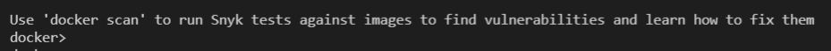

# Custom Docker Image

   
  <a href="./README.md">Home</a> |
  <a href="#environment-setup">Environment setup</a> |
  <a href="#build">Build</a> |
    <a href="#release">Release</a> 

# Enviroment setup
  1. Install Docker Desktop:
      * [Windows](https://docs.docker.com/desktop/windows/install/)
      * [*nix](https://docs.docker.com/engine/install/)
      * [*macOS](https://docs.docker.com/desktop/mac/install/)
  2. Create a [Docker Hub](https://hub.docker.com/) subscription
      * Compute services will reach out over the Internet to pull the image during app deployment
      * It must be hosted from a public image registry (Docker Hub)   
      * Verify your email, otherwise you will not be able to upload your image

# Build
  1. In your console, navigate to: `.\minecraft-vending-machine\scripts`
  2. Build image: 
  
      `.\build_docker.ps1 -gameDockerfile ..\deploy\Dockerfile.mc_bds -tag minecraft-bds:<tag>`
      * It's recommended you use a build version number as a tag and not 'latest'.
  3. Cool new security feature, container vulnerability scanning integrated right into the build pipeline. Made possible by [Synk!](https://docs.snyk.io/products/snyk-container/image-scanning-library/docker-hub-image-scanning)

      

      
      

      

      
      

      

      
      

      * To run an assessment on an image and output the results to a local file: `docker scan minecraft-bds:<tag>`

      * At this point, you can address any vulnerabilities found and re-package the image or accept risk and move on. 

# Release
  1. Test image

      `docker run --name test --rm -it -e debug=TRUE -e bds_version=<version> -e eula=TRUE minecraft-bds:<tag>`

        * Environmental settings:
          * Enable debug mode: `-e debug=TRUE`
          * Minecraft server EULA: `-e eula=TRUE`
          * Minecraft server version, specify "latest" or full version number: `-e bds_version=1.18.2.03`
      * Look for the following in the log output:
        * Correct server version
        * Server is up and listening: `IPv4 supported, port: 19132`
        

          
        

  2. Tag and push/upload image

      `docker tag minecraft-bds:<tag> <namespace>/minecraft-bds:<tag>`\
      `docker push <namespace>/minecraft-bds:<tag>`
    
      * Real-world example:

        `docker tag minecraft-bds:0.5 cooltechdad/minecraft-bds:0.6`\
        `docker push cooltechdad/minecraft-bds:0.6`

      * The image's public URI is displayed after a successful image push, take note of it, it should resemble: `docker.io/<namespace>/minecraft-bds:<tag>`

🎉 Congrats, you have successfully published your own Minecraft BDS container image to the Internet; now head over to the <a href="./deploy/deploy.md">deploy</a> doc to use it!